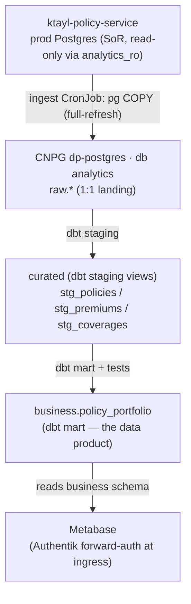

# Architecture

The platform reads the live policy source read-only, lands it in an analytics database it fully owns, and
transforms it up the medallion into a data product that Metabase serves.

## End-to-end flow

## What it owns vs reads

- **Owns:** the `analytics` database (schemas `raw` / `curated` / `business`) on the CNPG `dp-postgres`
  cluster, plus Metabase.
- **Reads:** the `ktayl-policy-service` prod policy DB — **read-only**, via a dedicated `analytics_ro`
  role with SELECT on the three source tables only.
- **No** cross-domain DB writes. Sources stay the authoritative system of record (the Policy domain); the
  platform holds **derived** copies only (ADR-005 — no shared operational DB).

## Medallion layers

| Layer | Schema | Contents |
|---|---|---|
| Raw | `raw` | 1:1 landing of the policy tables (`policies`, `coverages`, `premiums`) |
| Curated | `curated` | dbt staging views — typed / cleaned (`stg_policies`, `stg_premiums`, `stg_coverages`) |
| Business | `business` | the serve layer — `policy_portfolio` (what Metabase reads) |

## AuthN/Z & secrets

- Vault `secret/platform/data-platform` feeds ESO, which renders the k8s secrets (CNPG roles, policy
  read-only creds, Metabase creds). No secrets in code.
- Metabase is gated by **Authentik forward-auth** at the ingress (an embedded outpost, provider
  `metabase`) with a local admin behind it — Metabase OSS has no native OIDC. The provisioner talks to
  the **in-cluster service** (`http://metabase.data-platform.svc.cluster.local:3000`), which is ungated.

## Deployment (in minicloud-gitops, not here)

`manifests/data-platform/` carries the namespace + quota, the CNPG cluster, ESO secrets, network
policies, the ingest + dbt CronJobs, Metabase, and the ArgoCD app. The CronJobs **git-clone this repo**
to run the code — the deployment-vs-code separation.

## Observability & failure modes

- CNPG PodMonitor for the database; dbt source tests fail loudly on schema drift; ingest is atomic per
  table (truncate + load).
- **Policy DB down:** ingest fails, marts keep the last good data.
- **dbt test fails:** the build fails, so no bad data is served.
- **Analytics DB lost:** rebuild from source (data is derived — RTO 8h / RPO 24h acceptable, no PITR).

## Architecture decisions

- **ADR-1 — Light-first stack** (dbt + CNPG + Metabase) over ClickHouse / Kafka — need-first on a
  constrained cluster.
- **ADR-2 — Thin vertical slice** per live source, not a generic connector framework.
- **ADR-3 — Code repo (`ktayl-data-platform`) is separate from the deploy repo (`minicloud-gitops`).**
- **ADR-4 — Metabase forward-auth** rather than native OIDC (an OSS limitation).
