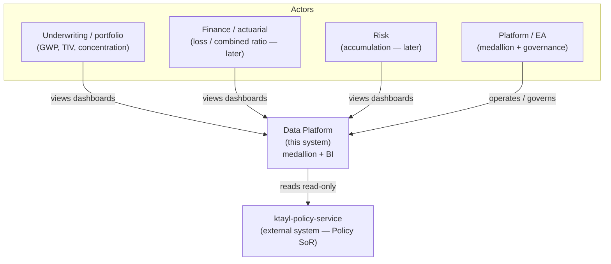
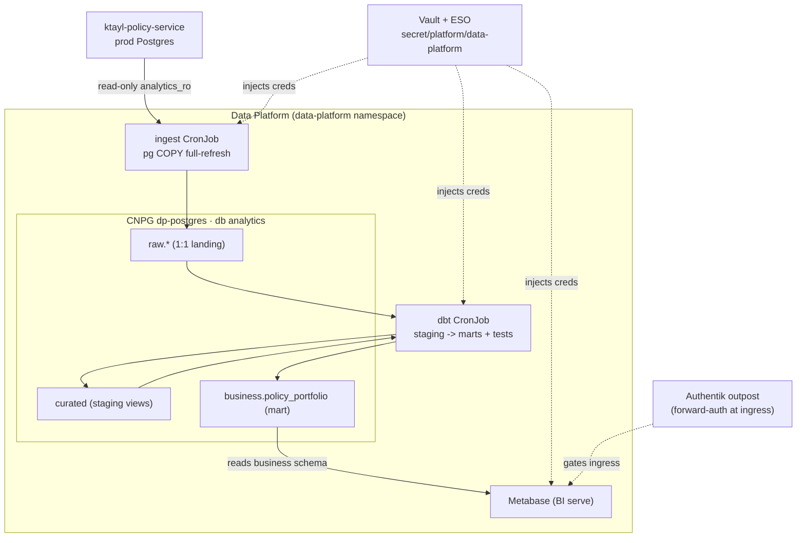
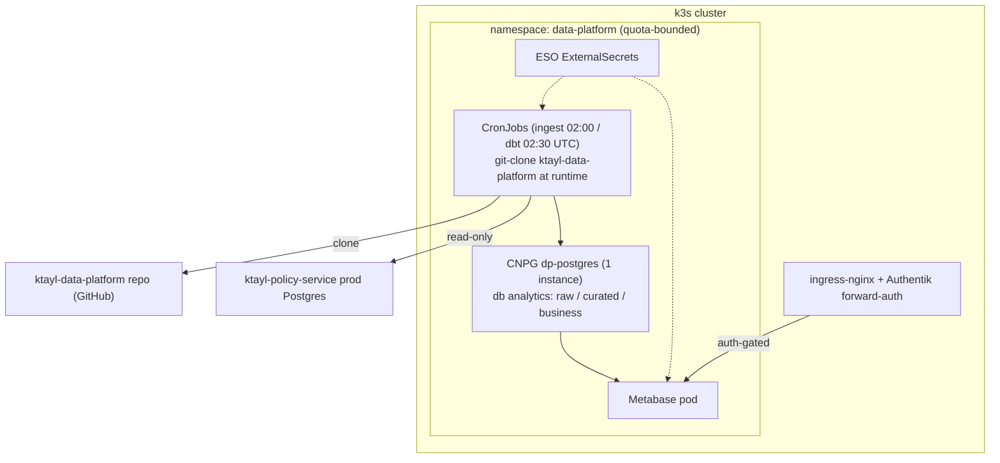

# System Design

This is the Solution-Architect artefact set for the Data Platform (a Path-C / boundary-crossing
product): C4 views, an NFR register, data-flow and ownership, failure modes, the scaling path, and a
STRIDE-lite threat model. The numbers below come from the product's PRD and architecture spine — they
describe the built Slice 1, not an aspiration.

## C4 views

### 1. System context

The Data Platform is one system inside the ktayl-solution IS. Its only external system dependency is the
`ktayl-policy-service` (the Policy system of record), which it reads **read-only**. Its consumers are the
business/EA roles who need portfolio, exposure and governance views.

### 2. Container view

Inside the boundary: two batch workloads (ingest, dbt), the analytics database that owns the three
medallion schemas, the BI tool, and the platform services that supply secrets and edge authentication.

### 3. Deployment view

Everything runs in the `data-platform` namespace on the 6-node k3s cluster. The CronJobs **git-clone this
code repo** at runtime; the analytics DB is a single CNPG instance; Metabase is reachable only through the
ingress, which is fronted by Authentik forward-auth.

## NFR register

Values are taken from the PRD (`docs/prd.md`) and the architecture spine.

| NFR | Requirement | How it is met |
|---|---|---|
| Footprint / quota | Fits the constrained 6-node cluster | CNPG 1 instance (3Gi), Metabase ~1.5Gi, dbt/ingest CronJobs. Namespace quota `data-platform` — req 1 CPU / 1.5Gi, lim 4 CPU / 4Gi |
| Freshness | Daily batch | ingest 02:00 UTC, dbt 02:30 UTC; on-demand via `kubectl create job` |
| Availability / DR | Derived data → rebuildable | RTO 8h / RPO 24h, no PITR — rebuild from source. Single instance (acceptable because the data is derived) |
| Security | Least privilege + no secrets in code | Read-only `analytics_ro` role (SELECT on 3 tables only); Vault -> ESO; default-deny ingress netpols; Metabase behind Authentik forward-auth |
| Observability | Fail loudly, no silent bad data | CNPG PodMonitor; dbt source + model tests fail the build on schema drift |

## Data flow and ownership

- **Sources are read-only.** The platform reads `ktayl-policy-service` through a dedicated read-only role
  and never writes back — there are **no cross-domain writes**.
- **The platform holds derived copies only.** `raw` is a 1:1 landing; `curated` and `business` are
  transformations of it. None of this is authoritative.
- **The source of truth stays the domain service.** The Policy domain remains the system of record for
  policies, coverages and premiums; the platform's copies can always be rebuilt from it (ADR-005 — no
  shared operational DB).

## Failure modes

| Failure | Effect | Behaviour |
|---|---|---|
| Policy DB down | ingest cannot read the source | ingest job fails; the marts keep the **last good** data (no partial overwrite — per-table truncate+load is atomic) |
| dbt test fails | schema drift / bad data detected | the dbt build **fails**, so no bad data reaches the `business` serve layer |
| Analytics DB lost | derived store gone | **rebuild from source** — RPO 24h acceptable because everything is derived; no PITR needed |

## Scaling path — need-first (a deliberate design decision)

The light-first stack (dbt + CNPG + Metabase) is chosen on purpose, not as a shortfall. Building a heavy
OLAP for domains that do not yet emit data is waste ("a warehouse for empty warehouses"). The heavy stack
is deferred behind an explicit gate:

- **Deferred (need-first):** ClickHouse / Kafka heavy OLAP, CDC (Debezium -> NATS), MDM-keyed Customer 360,
  multi-source marts.
- **The gate:** a **second live source** ships. Until then, the platform grows one thin vertical slice at a
  time. This is an accepted-and-documented boundary, revisited when the trigger fires — not a gap.

## Threat model (STRIDE-lite)

Data class is **CONFIDENTIAL** (policy / premium / exposure). The primary trust boundary is the ingress.

| Category | Threat | Mitigation |
|---|---|---|
| Spoofing | Unauthenticated access to dashboards | Authentik **forward-auth** at the ingress fronts Metabase (OSS has no native OIDC) |
| Tampering | Writing to the operational source | The source role is **read-only** (`analytics_ro`, SELECT-only) — cannot write back |
| Repudiation | Untraceable data changes | Batch jobs are code-defined and reproducible; ingest is atomic per table |
| Information disclosure | Secrets leaking / broad DB access | Secrets via **Vault -> ESO**, never in code; the read-only role limits blast radius to 3 tables |
| Denial of service | Runaway jobs starving the cluster | Namespace **quota** bounds the platform; jobs are scheduled off-peak |
| Elevation of privilege | Lateral movement in-cluster | **Default-deny ingress netpols**; the in-cluster Metabase service is reachable only by the pipeline, the ingress path is auth-gated |
